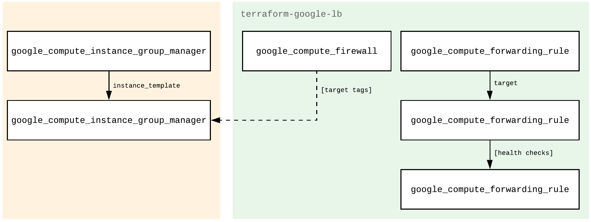

# Regional TCP Load Balancer Terraform Module
This is a collection of modules for external TCP/UDP load balancers. The root module is an implementation of passthrough regional TCP Load Balancer for GCE using target pool and forwarding rule. A regional proxy based external load balancer is implemented as a submodlue[modules/regional_proxy_lb/].

### Load Balancer Types
* **TCP load balancer**
* [HTTP/S load balancer](https://github.com/terraform-google-modules/terraform-google-lb-http)
* [Internal load balancer](https://github.com/terraform-google-modules/terraform-google-lb-internal)

## Compatibility
This module is meant for use with Terraform 0.13+ and tested using Terraform 1.0+. If you find incompatibilities using Terraform >=0.13, please open an issue.
 If you haven't
[upgraded](https://www.terraform.io/upgrade-guides/0-13.html) and need a Terraform
0.12.x-compatible version of this module, the last released version
intended for Terraform 0.12.x is [v2.3.0](https://registry.terraform.io/modules/terraform-google-modules/-lb/google/v2.3.0).

## Usage
Basic usage is as follows:
```hcl
module "load_balancer" {
  source       = "GoogleCloudPlatform/lb/google"
  version      = "~> 2.0.0"
  region       = var.region
  name         = "load-balancer"
  service_port = 80
  target_tags  = ["allow-lb-service"]
  network      = var.network
}

module "managed_instance_group" {
  source            = "terraform-google-modules/vm/google//modules/mig"
  version           = "~> 1.0.0"
  region            = var.region
  target_size       = 2
  hostname          = "mig-simple"
  instance_template = module.instance_template.self_link
  target_pools      = [module.load_balancer.target_pool]
  named_ports = [{
    name = "http"
    port = 80
  }]
}
```
Full functional examples are located in the [examples](./examples/) directory.

## Resources Created
**Figure 1.** Diagram of Terraform resources created by module (in green).


- [`google_compute_forwarding_rule.default`](https://www.terraform.io/docs/providers/google/r/compute_forwarding_rule.html): TCP Forwarding rule to the service port on the instances.
- [`google_compute_target_pool.default`](https://www.terraform.io/docs/providers/google/r/compute_target_pool.html): The target pool created for the instance group.
- [`google_compute_http_health_check.default`](https://www.terraform.io/docs/providers/google/r/compute_http_health_check.html): The health check for the instance group targeted at the service port.
- [`google_compute_firewall.default-lb-fw`](https://www.terraform.io/docs/providers/google/r/compute_firewall.html): Firewall that allows traffic from anywhere to instances service port.

<!-- BEGINNING OF PRE-COMMIT-TERRAFORM DOCS HOOK -->
## Inputs

| Name | Description | Type | Default | Required |
|------|-------------|------|---------|:--------:|
| allowed\_ips | The IP address ranges which can access the load balancer. | `list(string)` | <pre>[<br>  "0.0.0.0/0"<br>]</pre> | no |
| disable\_health\_check | Disables the health check on the target pool. | `bool` | `false` | no |
| firewall\_project | Name of the project to create the firewall rule in. Useful for shared VPC. Default is var.project. | `string` | `""` | no |
| health\_check | Health check to determine whether instances are responsive and able to do work | <pre>object({<br>    check_interval_sec  = number<br>    healthy_threshold   = number<br>    timeout_sec         = number<br>    unhealthy_threshold = number<br>    port                = number<br>    request_path        = string<br>    host                = string<br>  })</pre> | <pre>{<br>  "check_interval_sec": null,<br>  "healthy_threshold": null,<br>  "host": null,<br>  "port": null,<br>  "request_path": null,<br>  "timeout_sec": null,<br>  "unhealthy_threshold": null<br>}</pre> | no |
| ip\_address | IP address of the external load balancer, if empty one will be assigned. | `string` | `null` | no |
| ip\_protocol | The IP protocol for the frontend forwarding rule and firewall rule. TCP, UDP, ESP, AH, SCTP or ICMP. | `string` | `"TCP"` | no |
| labels | The labels to attach to resources created by this module. | `map(string)` | `{}` | no |
| name | Name for the forwarding rule and prefix for supporting resources. | `string` | n/a | yes |
| network | Name of the network to create resources in. | `string` | `"default"` | no |
| project | The project to deploy to, if not set the default provider project is used. | `string` | `""` | no |
| region | Region used for GCP resources. | `string` | n/a | yes |
| service\_port | TCP port your service is listening on. | `number` | n/a | yes |
| session\_affinity | How to distribute load. Options are `NONE`, `CLIENT_IP` and `CLIENT_IP_PROTO` | `string` | `"NONE"` | no |
| target\_service\_accounts | List of target service accounts to allow traffic using firewall rule. | `list(string)` | `null` | no |
| target\_tags | List of target tags to allow traffic using firewall rule. | `list(string)` | `null` | no |

## Outputs

| Name | Description |
|------|-------------|
| external\_ip | The external ip address of the forwarding rule. |
| target\_pool | The `self_link` to the target pool resource created. |

<!-- END OF PRE-COMMIT-TERRAFORM DOCS HOOK -->

## health_check variable

The `health_check` variable values are passed on to the `google_compute_http_health_check` resource. Setting values to `null` will use `google_compute_http_health_check` [defaults](https://www.terraform.io/docs/providers/google/r/compute_http_health_check.html#argument-reference). It takes the following parameters:

| Name | Description | Default | Requirement |
| --- | --- | --- | --- |
| check_interval_sec | How often (in seconds) to send a health check | `5` | no |
| healthy_threshold | A so-far unhealthy instance will be marked healthy after this many consecutive successes | `2` | no |
| host | The value of the host header in the HTTP health check request | `""` | no |
| port |  The TCP port number for the HTTP health check request | `80` | no |
| request_path | The request path of the HTTP health check request | `/` | no |
| timeout_sec | How long (in seconds) to wait before claiming failure | `5` | no |
| unhealthy_threshold | A so-far healthy instance will be marked unhealthy after this many consecutive failures | `2` | no |
